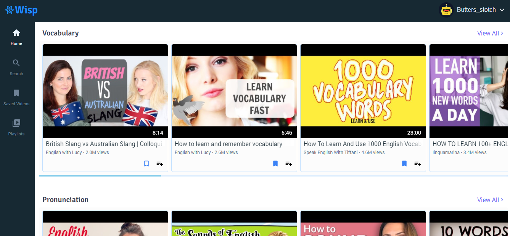

<!-- PROJECT LOGO -->
<p align="center">
  <a href="https://github.com/akshay-rajput/watch.wisp/">
    
  </a>

  <h3 align="center">Wisp</h3>

  <p align="center">
    A video library app which has curated youtube videos related to vocabulary and english pronunciation. 
    <br />
    <a href="https://watch-wisp.netlify.app">View Demo</a>
    ·
    <a href="https://github.com/akshay-rajput/watch.wisp/issues">Report Bug</a>
  </p>
</p>


<!-- TABLE OF CONTENTS -->
<details open="open">
  <summary><h2 style="display: inline-block">Table of Contents</h2></summary>
  <ol>
    <li>
      <a href="#about-the-project">About The Project</a>
      <ul>
        <li><a href="#built-with">Built With</a></li>
      </ul>
    </li>
    <li>
      <a href="#getting-started">Getting Started</a>
      <ul>
        <li><a href="#prerequisites">Prerequisites</a></li>
        <li><a href="#installation">Installation</a></li>
      </ul>
    </li>
    <li><a href="#roadmap">Roadmap</a></li>
    <li><a href="#contact">Contact</a></li>
  </ol>
</details>


<!-- ABOUT THE PROJECT -->
## About The Project



A video library app which has curated youtube videos related to vocabulary and English pronunciation. A user can view videos, signup, create & manage playlists. 
This app uses UseContext + UseReducer for state management. Implemented features include dynamic routing, searching a video, save videos, user management, managing playlists, JWT authentication etc. 

### Built With

* [Reactjs](https://reactjs.org/docs/getting-started.html)
* [react-router](https://reactrouter.com/)
* [Mint Css](https://mintui.netlify.app/)

You can view all open source resources & libraries used in this project on this [acknowledgements](https://watch-wisp.netlify.app/acknowledgements) page.

<!-- GETTING STARTED -->
## Getting Started

This project uses [Vite](https://vitejs.dev/) as a build tool.
To get a local copy up and running follow these simple steps.

### Prerequisites

Vite requires Node.js version >=12.0.0.
* npm
  ```sh
  npm install npm@latest -g
  ```

### Installation

1. Clone the repo
   ```sh
   git clone https://github.com/akshay-rajput/watch.wisp.git
   ```
2. Install NPM packages
   ```sh
   npm install
   ```
3. Start dev server
   ```sh
   npm run dev
   ```

<!-- ROADMAP -->
## Roadmap

See the [Project board](https://github.com/akshay-rajput/watch.wisp/projects/1) for related information.


## Contact

Reach out to me [@twitter](https://twitter.com/_AkshayRajput)

Project Link: [Netlify](https://watch-wisp.netlify.app)
